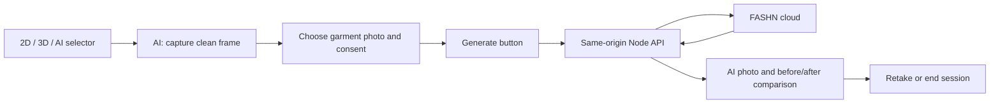

# AI try-on research and proposed implementation

Researched 2026-09-27. User selected a paid cloud API, acknowledging that customer photos leave the computer. This document is a plan, not a report of an implemented or benchmarked integration.

## Recommendation

Add a third mode, **AI photo**, alongside the existing live 2D and 3D modes. Capture an ordinary camera/video frame, pair it with a garment product photo, generate a dressed image, and let the customer compare the result with the capture. The existing MediaPipe tracking already uses AI; the new feature is **generative virtual try-on**.

Use **FASHN's hosted API**, through its official TypeScript SDK and a small local Node backend. Start with `tryon-max`, explicitly selecting `generation_mode: fast`, `resolution: 1k`, and one output. Offer `tryon-v1.6` in a developer-configured fast comparison preset. This recommendation reflects integration fit and documented capabilities, not our own image-quality benchmark.

The [Max documentation](https://docs.fashn.ai/api-reference/tryon-max) currently quotes about 10 seconds for fast/1K and 1 credit per output. [v1.6](https://docs.fashn.ai/api-reference/tryon-v1-6) documents roughly 5 seconds in performance mode and 1 credit. These are provider processing estimates, not complete kiosk response-time guarantees. Neither endpoint produces continuous live tracked video.

[Current API pricing](https://help.fashn.ai/plans-and-pricing/api-pricing) lists $0.075 per on-demand credit and a $7.50 minimum purchase for 100 credits. Thus one output at either selected preset is approximately $0.075, excluding other costs. Account pricing can differ; verify it before purchase. API credits are separate from the vendor's consumer app credits.

## Projects reviewed

| Project | Practical use here | Decision |
| --- | --- | --- |
| [FASHN TypeScript SDK](https://github.com/fashn-AI/fashn-typescript-sdk) | Maintained vendor API client; server-side generation/status calls | Use on the backend |
| [FASHN sample try-on app](https://github.com/fashn-AI/tryon-nextjs-app) | Existing image selection/result UI and API integration reference | Adapt ideas; preserve our Vite app |
| [FASHN VTON 1.5](https://github.com/fashn-AI/fashn-vton-1.5) | Local model accepting person and clothing images | Future local experiment, not needed for selected cloud plan |
| [CatVTON](https://github.com/Zheng-Chong/CatVTON), [IDM-VTON](https://github.com/yisol/IDM-VTON) | Research image try-on implementations | Their repositories specify noncommercial licences; unsuitable as our default shop deployment path |
| [Leffa](https://github.com/franciszzj/Leffa) | Image try-on and pose transfer; repository code is MIT | Alternative research; separately verify all checkpoints and preprocessing dependencies |
| [MagicTryOn](https://github.com/vivoCameraResearch/Magic-TryOn) | Released video try-on research | Separate future video experiment, not evidence of a ready webcam integration |
| [LiveVVT](https://github.com/caoyushe/LiveVVT) | Research specifically targeting real-time video try-on | Its README still says implementation is being prepared; cannot base delivery on it |

The local FASHN model and its full pipeline must be distinguished: the main model/repository are Apache-2.0, but the [human parser dependency](https://github.com/fashn-AI/fashn-human-parser/blob/main/LICENSE) references [SegFormer's noncommercial licence](https://github.com/NVlabs/SegFormer/blob/master/LICENSE). The inspected pipeline initializes and runs that parser even with its segmentation-free option. Do not label the unmodified local stack commercially cleared based on the top-level licence alone. This local dependency is not being installed for our cloud integration.

The workstation reports an AMD Radeon RX 9070 XT. AMD documents a [supported Windows PyTorch configuration](https://rocm.docs.amd.com/projects/radeon-ryzen/en/latest/docs/compatibility/compatibilityrad/windows/windows_compatibility.html), but that does not establish compatibility of a particular try-on pipeline. Cloud inference avoids requiring local ROCm, CUDA, Python models, or GPU inference packages.

## Product flow and architecture

Keep a single camera source. Capture from the raw video, not the composited shirt canvas. Do not automatically upload frames or generate when a garment is merely selected. AI inputs are photographs, not GLB files. The existing plain 3D shirt render can be an explicitly labelled demo reference; store-product fidelity needs real shop garment photos.

The browser continues making only same-origin requests. A Node backend holds the secret API key and communicates with FASHN. Preserving browser CSP does **not** mean the AI feature is local-only; update the app's privacy text accordingly. Serve the built frontend and API together in production; use a Vite `/api` proxy in development.

## Privacy and operational boundaries

Use base64 image inputs and request base64 outputs to avoid adding a public photo storage service. FASHN documents temporary input processing copies, base64 result availability for 60 minutes, and request metadata that is not automatically deleted. See [Data Retention & Privacy](https://docs.fashn.ai/api-overview/data-retention-privacy). Local cleanup does not erase a submitted provider request or guarantee a refund.

Generate only after a clear customer action and session consent. Keep local customer images in memory with a short expiry, clear them between customers, and never put them in Git, localStorage, logs, or analytics. Add request deduplication and backend limits so repeated taps do not create repeated charges.

Results can still alter identity, body shape, text/logos, or garment details. Test those explicitly. AI photo mode is not a size recommendation, fabric simulation, or measurement service. Generated animation of the photo would depict synthesized motion, not follow the customer's current movements.

## Delivery order

1. Add the third mode, clean capture, product-photo inputs, consent, and result states.
2. Add backend/provider integration, a fake provider for automated tests, and configuration without exposing secrets.
3. Prove image processing, job ownership, duplicate handling, cleanup, failure states, and production routing.
4. Add credentials locally and run a deliberately limited real test on an approved image pair. Record latency, quality issues, and actual credits.
5. Test the real camera/touchscreen and several garment types. Keep the existing live modes working throughout.

The complete implementation instructions are in [CLAUDE_AI_TRYON_PROMPT.md](CLAUDE_AI_TRYON_PROMPT.md).

## What changed after implementation (2026-09-28)

- **Garment photos must not show a person.** In real generations, on-model stock photos let the
  provider copy the model's face and accessories (shemagh, sunglasses) onto the user. The catalogue
  now uses only flat-lay or ghost-mannequin product photos (`assets/garments/ai/SOURCE.md`).
- **Online as well as on the kiosk.** The same backend also runs as a Vercel Function, with shared
  state in Upstash Redis and an access code protecting the operator's key (README, "Deploying to
  Vercel").
- **Visitor keys.** A visitor may use their own FASHN key, kept in their browser and sent only with
  their own requests (`AI_USER_KEYS`; turn it off on a shared kiosk). The browser still talks only
  to its own origin; the server forwards the key to FASHN and never stores it.
