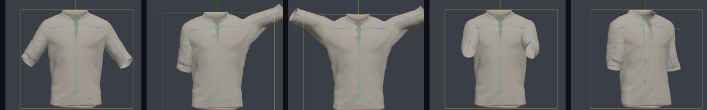
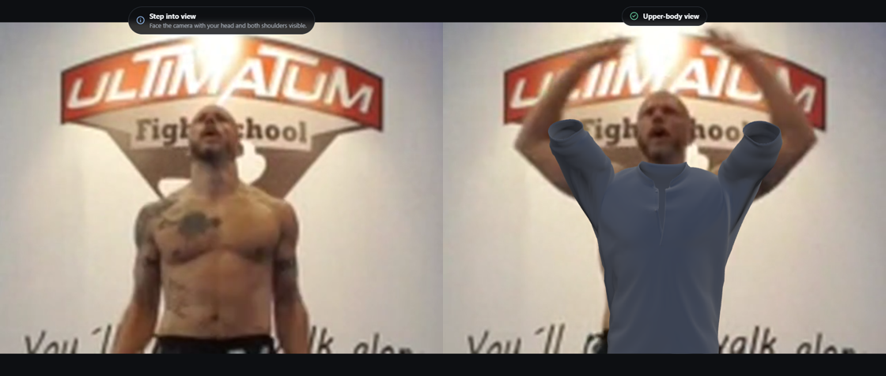
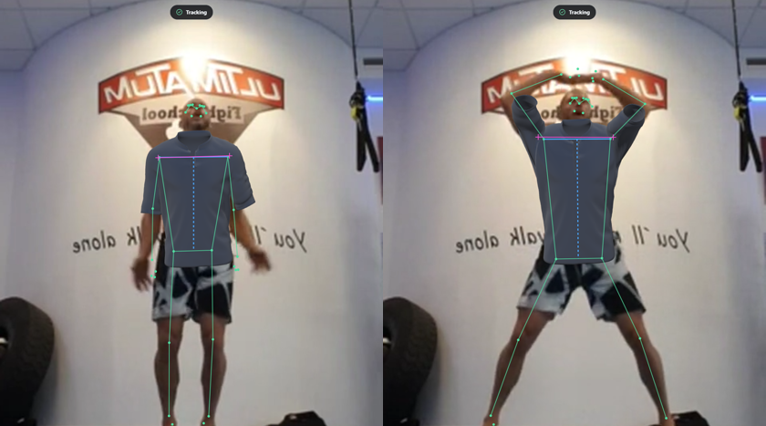
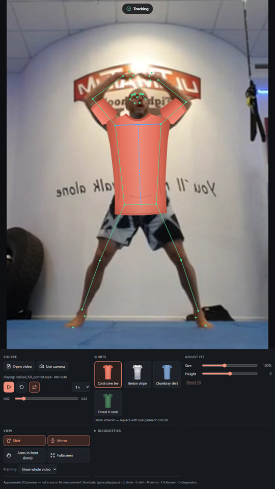
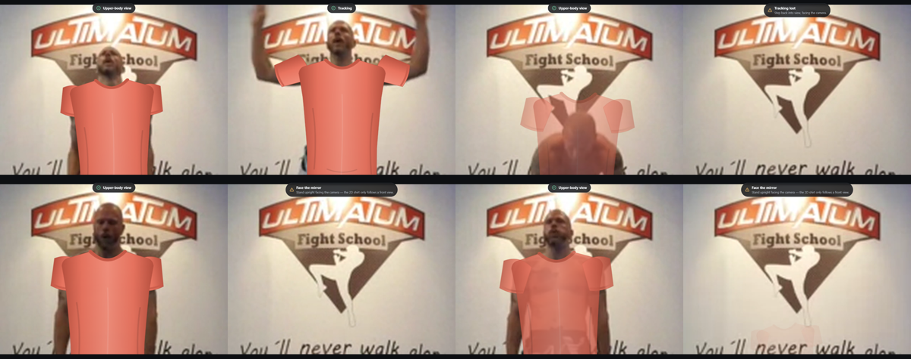
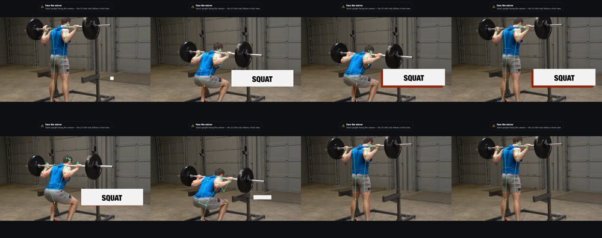

# Testing

Date: 2026-09-26. Machine: Windows 10 Pro (10.0.19045), AMD Ryzen 9 5900X, 32 GB RAM, **AMD Radeon
RX 9070 XT** (driver 32.0.31041.1004; WebGL renderer "ANGLE (AMD … Direct3D11)"), Node 24.19.0.
Browser: Playwright Chromium 153.0.8010.12 (headless, real GPU via ANGLE/D3D11). The user's own video
and a physical webcam were **not available** (see "Not verified").

## Later changes (branch `development`, 2026-09-27 → 2026-09-28)

English/Arabic translation with right-to-left layout, the Vercel deployment (Upstash Redis, access
code), visitor FASHN keys, the women's 3D V-neck, product-only AI garment photos and the AI result
download.

| Command | Result |
| --- | --- |
| `npm test` (2026-09-28) | ✅ **260 passed**, 4 skipped, in 24 files. The skipped file is `tests/server/redis.integration.test.ts`, which needs a real Redis in Docker (see the comment at its top). |
| Browser tests | **33** in `npm run test:e2e` (6 files) and **10** in `npm run test:e2e:preview`. Counted with `--list`; not re-run for this entry. |

What the new tests cover:

- **Arabic:** `tests/unit/i18n.test.ts` fails on any Arabic message that is missing or still in
  English; `tests/e2e/app.spec.ts` switches the whole app to Arabic (right to left, remembered) and
  opens `/research?lang=ar`.
- **Several server instances** (`tests/server/jobs.test.ts`, "several server instances sharing one
  store"): a duplicate sent to two instances creates one provider job, global concurrency holds
  across instances, another instance finishes a job whose submitting instance disappeared, and a
  submission lost with its instance becomes uncertain and keeps its credit.
- **Vercel** (`tests/server/vercel.test.ts`): Redis and an access code are required, uploads fit the
  4.5 MB request limit, cookies are Secure, the whole flow works across instances, only the site's
  own origin and `/api/ai` paths are accepted, wrong access codes are limited, and a wrong or
  unreachable Redis is reported up front.
- **Visitor keys** (`tests/server/config.test.ts`, `tests/unit/aiController.test.ts`,
  `tests/e2e/ai.spec.ts`): the operator's key is optional, a visitor's key is sent only with their
  own requests, and `AI_USER_KEYS=false` turns the option off.
- **Women's V-neck** (`tests/unit/modelLoader.test.ts`): the baked FBX2glTF conversion loads in the
  same layout as the men's model, with the rest pose within 0.1 mm.
- **Result download** (`tests/e2e/ai.spec.ts`): the Download button saves the result image.

Checked by hand before deploying: `vercel build` on exactly the files a Git deployment contains, then
the packaged function against a real Redis in Docker with the offline fake provider (access code →
session → job → result → end session).

**Real FASHN generations** were tried by eye during development. With on-model garment photos the
provider copied the model's face and accessories (shemagh, sunglasses) onto the user, so the
catalogue was switched to product-only flat-lay / ghost-mannequin photos. Timings, credits and a
structured quality review are still **not recorded** (see "Not verified: steps to finish AI
validation" below).

## AI photo mode (branch `development`, 2026-09-27)

Same machine and browser. Node 24.19.0. New packages (exact versions in `package-lock.json`): fashn
0.15.0, fastify 5.12.5, @fastify/multipart 10.1.2, @fastify/rate-limit 11.2.0, @fastify/static 10.1.5,
sharp 0.35.4 (libvips 8.18.6); dev: tsx 4.23.15, concurrently 10.0.5. `npm audit`: 0 vulnerabilities.

Baseline before any change: typecheck ✅, lint ✅, 107 unit tests ✅, `npm run test:e2e` ✅ 20/20.

> **What this proves and what it does not.** Everything below ran **offline**: against the fake
> provider (stamped "TEST RESULT", no AI) or the real FASHN adapter with a **mocked transport**.
> **No real FASHN generation was made**: no API key or approved photo pair was available, so real
> inference, provider latency, credits charged and image quality are **not verified**. No physical
> webcam or touchscreen was used.

### Automated checks after the change

| Command | Result |
| --- | --- |
| `npm run check` (typecheck incl. new server project + Biome + Vitest + frontend and server builds) | ✅ 151 files lint-clean; **218 tests** in 21 files (107 existing + 111 new: 88 backend, 23 browser logic) |
| `npm run test:e2e` (Vite + backend with fake provider) | ✅ **28 passed** (20 existing + 8 new) |
| `npm run test:e2e:preview` (production server: `dist/` + `/api` at one origin) | ✅ **10 passed** (7 existing + 3 new) |
| `npm run smoke:ai` refusal paths (no args / fake provider / no `--confirm-paid-generation`) | ✅ refuses; nothing sent |
| `npm run smoke:ai` with a real key | ⚪ **not run** (no key; paid) |

The new AI e2e tests were also repeated 3× in a row (24/24) after fixing a race (below).

### What the new tests cover

- **Provider request schemas** (`tests/server/presets.test.ts`): Try-On Max sends exactly
  `model_image, product_image, generation_mode: 'fast', resolution: '1k', num_images: 1,
  output_format: 'jpeg', return_base64: true, seed`; v1.6 sends `garment_image, category,
  garment_photo_type` (from product metadata), `mode: 'performance', num_samples: 1`. Neither sends the
  other model's parameter names or a prompt.
- **Real FASHN adapter over a mocked `fetch`** (`fashn.test.ts`): one `POST https://api.fashn.ai/v1/run`
  with `Authorization: Bearer` and the exact body; **no retry** after a connection failure, timeout,
  500 or 503 (reported as *ambiguous*); 401 / 429 OutOfCredits / 429 rate or concurrency / 400
  mapped to definite rejections with sanitized messages; `GET /v1/status/{id}` shape validation and
  the `x-fashn-credits-used` header; nothing (key or image data) logged even with `FASHN_LOG=debug`.
- **Images** (`images.test.ts`): magic-byte type detection (JPEG/PNG/WebP only); SVG, text, empty,
  truncated, animated WebP, tiny and 20:1 images rejected; byte and decoded-pixel limits (a 4000×4000
  PNG under 200 KB is refused); EXIF orientation applied and all metadata (EXIF/ICC/XMP) removed;
  aspect ratio kept, downscale only. Provider output: only a base64 raster data URI is accepted;
  URLs (never fetched), HTML, SVG, bad base64, type mismatch, oversize and the `_expired` marker are
  refused.
- **Jobs and spending** (`jobs.test.ts`, `ledger.test.ts`): 5 simultaneous duplicates → one
  provider submission; reuse of a request ID with other inputs refused; one active job per session;
  global concurrency (abandoned in-flight jobs still count); daily cap; an ambiguous submission is
  never retried and stays reserved; a definite rejection and documented provider failures release the
  credit; completed/bad-output are charged; deadline → *uncertain*; transient status errors recover
  without resubmitting; the ledger survives a restart (a crashed in-flight reservation still counts),
  uses the UTC day, and fails closed when corrupt.
- **HTTP API** (`app.test.ts`, `config.test.ts`): unconfigured AI reports its reason and never calls
  the provider; the key never appears in responses; missing marker header, foreign Origin, cross-site
  Sec-Fetch-Site and unknown Host (DNS rebinding) → 403, no CORS headers; POST without Origin → 403;
  HttpOnly SameSite=Strict path-scoped cookie; consent version, request UUID, garment allowlist (incl.
  `../../package.json`), preset, uploads switch and image validation checked before any submission;
  streaming upload limit → 413; three concurrent identical HTTP posts → one job; cross-session read,
  download and delete → 404; End session and idle expiry purge results; abandoned jobs never expose a
  late result; unknown `/api` routes are JSON 404s; production serves `dist/`, SPA fallback and the
  API at one origin with the CSP header; safe configuration defaults and invalid settings rejected.
- **Browser state machine** (`aiController.test.ts`): activation, capture and garment choice send
  nothing; consent is asked before the first upload and declining sends nothing; repeated clicks →
  one submission; queued → generating → result; "Try another garment" reuses the original capture,
  never the generated image; retake, garment change, leaving AI mode and unmount discard late results;
  End session revokes object URLs and requires a new opt-in; polling interruptions show a notice and
  never resubmit; after a lost submission, the explicit retry reuses the same request ID (server
  dedupes); the local deadline gives up without resubmitting.
- **Preferences** (`tryOnMode.test.ts`): 3D stays the default; old stored preferences migrate
  (mode follows the stored garment); each live mode remembers its garment across 2D → AI → 3D → 2D;
  inconsistent data is repaired; no photo/consent/session data is stored. AI catalogue entries have
  unique product photos, category, photo type, provenance and valid live links.
- **Browser (`tests/e2e/ai.spec.ts`)**:
  - the 2D / 3D / AI selector and per-mode garment memory; live modes make **no** `/api` request;
    entering AI only reads capabilities;
  - **clean capture**: the captured frame equals the video element's own pixels (native 320×240, not
    the stage canvas size), is identical with mirror on and off, and on real footage matches the raw
    video while the stage canvas (with the 3D shirt drawn) clearly differs;
  - full flow with the fake provider: capture pauses the file video and the engine stops inference
    (`aiView: 'still'`); consent dialog (declining sends nothing); progress labels + elapsed time;
    labelled result with TEST RESULT badge, mirrored consistently; Before / After / Side by side;
    try another garment on the same photo; a double click creates one job; End session resumes the
    video, deletes the session and asks the next customer again; only same-origin requests;
  - switching to 3D mid-generation ends the AI session; after the fake provider finishes, returning to
    AI shows nothing stale and no result is downloaded;
  - a developer photo can replace the camera; backend down (502) and unconfigured states explain the
    setup while 3D keeps working;
  - **production** (also in the preview run): a planted dummy key never appears in any HTML/JS/JSON
    the browser receives; results are `image/jpeg` with `Cache-Control: no-store`; unknown `/api`
    routes return JSON 404.
- The frontend bundle contains no server code: no `api.fashn.ai`, `x-fashn-credits-used`,
  `predictions.run`, Fastify or Sharp code (checked with grep on `dist/`; `FASHN_API_KEY` appears
  only as the variable name in the staff setup text).

### Issues found and fixed during testing

- The Fastify error handler was registered after the API plugin, so API errors used Fastify's default
  body shape. Found by `app.test.ts`; the handler is now registered first.
- Leaving AI mode could send a job DELETE that raced the session purge (harmless 401). Ending a session
  now relies on the purge, and in-flight status reads are aborted.
- Split-view layout on a portrait kiosk; fixed after screenshot review.

### Visual review (fake provider only)

Screenshots of every AI state at 1280×800 and 1080×1920 (live guidance, review, consent, progress,
result, side by side) were checked by eye. The fake result is the capture with a red TEST RESULT
banner, so this says nothing about generated image quality. With mirror on, the whole result image
is mirrored like the capture, including the banner text (the unmirrored label keeps it readable).

### Not verified: steps to finish AI validation

1. Buy API credits, put the key in `.env` on the kiosk PC (`FASHN_API_KEY`, `AI_ENABLED=true`).
2. Get consent from a tester and choose one photo of them plus one real product photo.
3. Run `npm run smoke:ai -- --person <photo> --garment <catalogue id or product photo>
   --confirm-paid-generation --save-result test-results\ai-smoke\result.jpg` and record the preset,
   dimensions, timings and credits from the JSON report here.
4. Review the image for face/identity, garment colour, text/logos, seams, sleeves, crossed arms,
   background, body shape, and loose/long → fitted/short clothing.
5. Try the full flow on the kiosk with the physical webcam and touchscreen, then several garment types
   with real shop photos.

## Live 3D garments (branch `dev/live-3d-garments`, 2026-09-26)

Same machine and browser as below. Baseline before any change: `npm run check` ✅ (63 unit
tests, lint clean, build OK) and `npm run test:e2e` ✅ 13/13. There were no pre-existing failures.

### Automated checks after the change

| Command | Result |
| --- | --- |
| `npm run check` (typecheck + Biome + Vitest + build) | ✅ 113 files lint-clean; **106 unit tests** in 12 files (63 existing + 43 new); build OK |
| `npm run test:e2e` (dev server, Strict Mode) | ✅ **20 passed** (13 existing + 7 new), including 4 that use the downloaded footage |
| `npm run test:e2e:preview` (production build + `vite preview`) | ✅ **7 passed**: GLB load, mode/asset switching, context loss, real footage + cloth, and three privacy tests |

Nothing is skipped when `test-footage/` is present. Without it, the footage-based tests skip (they
are marked so).

### New automated coverage (what it proves)

- **Landmark pairing/transfer** (`tracking3d.test.ts`):
  - image and world landmarks are copied *before* `close()` and paired by person index;
  - mismatched arrays give `world: null`, never a wrong pair;
  - both buffers are transferred, and pairing survives `postMessage`-style cloning;
  - worker and main-thread paths produce identical output (same copy function);
  - a result arriving after a seek (stale generation) is dropped.
- **Subject correspondence** (`fit3d.test.ts`): two people with changing result order; the world
  pose used always belongs to the tracked subject.
- **Rig and retargeting on the real GLB** (`modelLoader.test.ts`, `retargeter.test.ts`):
  - one skinned mesh, 19 joints, and the full unweighted hierarchy is retained;
  - the rest pose rebuilt from the inverse bind matrices reproduces the vertices (<0.1 mm);
  - a neutral pose equals the bind pose;
  - arm aiming reaches the target direction; parent-local = parent⁻¹ · world;
  - raising the anatomical LEFT arm moves only the +X (wearer-left) sleeve;
  - torso and sleeves stay connected, with bounded stretch at 90° abduction and no tearing at 150°;
  - 200 random or degenerate targets give finite, normalized quaternions;
  - thighs follow the pelvis.
- **Coordinates and registration** (`fit3d.test.ts`):
  - MediaPipe world → body axes; robust torso frames (near-collinear inputs, missing hips,
    degenerate input);
  - recovered yaw and lean; the fade toward the turn limit; the image-only fallback;
  - low-confidence elbows;
  - garment shoulder anchors land on the image shoulders (midpoint within 1 px, direction within 1°)
    for turns, tilts, scales, portrait and landscape frames — and still do after the display
    transform, with mirror on/off, contain/cover, 1080×1920 and 1600×900 viewports, and DPR 1 and 2.
- **Filtering:**
  - shortest-path quaternion slerp and bounded angular speed;
  - opposite directions produce no NaN;
  - a missing elbow holds, then fades to a neutral hanging arm with no snap;
  - reset forgets motion.
- **Turn limits** (`tracking3d.test.ts`):
  - a 45° turn is followed in 3D but still rejected for 2D art;
  - 85° stays hidden in 3D;
  - the 2D thresholds are unchanged.
- **Occlusion:**
  - a forearm in front of the torso gives a depth-gated cutout that starts past the elbow;
  - hanging arms or forearms behind the torso give none;
  - low-confidence wrists give none.
- **Physics** (`cloth.test.ts`, Node build of Jolt, deterministic media clock):
  - a small-cloth proof: pinned vertices follow a moving skinned joint (<0.1 mm); free vertices
    stay within max distance; stretch below 5% while hanging; no penetration of a moving capsule;
  - the garment proxy has 1,007 particles, explicit seam welds, render mapping limited to connected
    neighbours, and no particle spanning surfaces;
  - real bounded motion: peak >5 mm and ≤ limit + 2 cm; pinned error <0.1 mm; free-edge stretch
    p99 <1.3; only the initial reset;
  - pause freezes the fabric with no catch-up burst;
  - resets happen on backward time, a 3 s gap (no 180 catch-up steps) and reacquisition;
  - runs are bit-identical for identical input;
  - tuning rebuilds work, and disposal is idempotent.
- **Browser (`garment3d.spec.ts`, `privacy.spec.ts`):**
  - the GLB loads from `/garments/3d/vneck/shirt-male.glb` (HTTP 200) and is the default garment;
  - in the inspection view the real model renders, and a *left* arm pose changes the image-right
    region far more than the other side;
  - 4× switching of garment, fabric and cloth on/off causes no errors and no tracker reload;
  - WebGL unavailable gives an explicit error and the labelled 2D development fallback, and video
    still works;
  - WebGL context loss is reported and recovers;
  - on real footage the garment visibly changes the torso region, and cloth runs with >500
    particles and bounded deviation;
  - with the 3D shirt and cloth active, the GLB and Jolt WASM load from localhost and **0 external
    requests** are made (dev and production preview).

### Visual review (real footage + deterministic poses)

The development inspection view (`/?inspect=3d`) shows five deterministic poses of the actual GLB:
bind pose, wearer's left arm raised (appears on the image right: unmirrored), both raised, arms
forward, and a 30° turn. Torso and sleeves deform as one connected mesh. The armpit stretch with
raised arms is visible and documented.

*Left:* before the tracker has acquired the person (no garment; the original clothing is visible).
*Right:* tracked chest-up frame with both arms raised; the sleeves follow the arms.

Mirrored 1080×1920 kiosk, cover crop, landmark overlay. The magenta garment shoulder anchors sit on
the tracked shoulders (blue), so registration survives mirroring and cropping.

Cases reviewed:

| Case | Result |
| --- | --- |
| Neutral / arms at the sides | ✅ registered on shoulders; collar at the neck base after a calibration fix (it sat at the chin before) |
| Left arm, right arm, both raised | ✅ sleeves follow independently; armpit stretch and "stubby" sleeves when hands are overhead |
| Modest turns | ✅ in synthetic poses and the dance clip (since retired); ⚠️ no slow real turn footage |
| Leaning / bending | ✅ lean follows (synthetic); bending over is hidden (existing rule) |
| Toward/away movement | ⚠️ scale follows image lengths; only digital crops and burpees available |
| Tracking loss and recovery | ✅ burpees and leave/re-enter (since retired): fades out, reacquires with a reset (cloth resets too) |
| Crossed forearms (occlusion) | ⚠️ **no footage with forearms crossed in front of the chest**; synthetic tests only. On real clips the cutouts only touched forearms outside the garment; no torso holes |
| Head dropped forward | ⚠️ the stand collar overlaps the chin (documented) |
| Physical webcam | ❌ **not tested** (none connected); only Chromium's fake camera |

### Performance (measured, not guaranteed)

Headless Chromium 153, real GPU (AMD RX 9070 XT, ANGLE/D3D11), DPR 1, Full model on GPU in the
worker, "Jumping jacks and burpees" (640×480, 30 fps), mirror on, cover framing. Values come from
the in-app diagnostics after 16 s of playback. Canvas = visible canvas; render = WebGL garment
layer. Timer resolution in the browser is ~0.1 ms.

| Viewport | Mode | Build | Render/s | Inference/s | Inference ms (med/p95) | Pose age ms (med) | Garment render ms (med/p95) | Layer copy ms | Cloth solver ms (med/p95) | Canvas / render size |
| --- | --- | --- | --- | --- | --- | --- | --- | --- | --- | --- |
| 1920×1080 | skeletal | dev | 29.7 | 29.8 | 16.7 / 23.4 | 33 | 0.2 / 0.3 | ≤0.1 | — | 1580×1080 / 1580×1185 |
| 1920×1080 | cloth | dev | 29.6 | 30.0 | 15.0 / 24.4 | 33 | 3.0 / 4.0 | ≤0.1 | 1.4 / 2.0 (+0.7 mapping) | same |
| 1080×1920 | skeletal | dev | 29.8 | 30.1 | 15.8 / 21.5 | 33 | 0.2 / 0.3 | ≤0.1 | — | 1080×1239 / 1652×1239 |
| 1080×1920 | cloth | dev | 29.4 | 29.7 | 14.7 / 21.1 | 33 | 3.0 / 3.8 | ≤0.1 | 1.4 / 2.1 | same |
| 1080×1920 | cloth | production | 30.1 | 30.0 | 15.6 / 24.8 | 33 | 3.0 / 3.6 | ≤0.1 | 1.4 / 2.1 | same |
| 1920×1080 | skeletal | production (chest-up clip) | 29.9 | 29.6 | 15.1 / 21.7 | 33 | 0.2 / 0.3 | ≤0.1 | — | 1580×1080 / 1580×1185 |

- Rendering runs once per presented video frame, so ~30 render/s *is* the source rate. This machine
  reaches the 30 FPS target with a large margin.
- The 14,079-triangle mesh is not a bottleneck (0.2 ms), so it was **not reduced**.
- The first frame after load pays one-time shader compilation (~75–85 ms).
- Cloth mode: 1,007 particles, 1 substep per 30 fps frame (2 at the 60 Hz fixed step when needed),
  ~3 ms total including CPU skinning and normals. Up to 84 ms of media time was dropped in 16 s,
  across reacquisitions; the solver never catches up.
- JS heap after 16 s: 11–22 MB (production), 44–66 MB (dev).
- Unit-test timings for the solver in Node: ~1.5–1.9 ms/frame.
- The kiosk PC's own numbers are unknown until measured there (Diagnostics panel).

## Original 2D prototype checks

### Automated checks (all passing)

| Command | Result |
| --- | --- |
| `npm run typecheck` (TypeScript 7.0.2, strict) | ✅ no errors |
| `npm run lint` (Biome 2.5.14) | ✅ 81 files, no issues |
| `npm test` (Vitest 5.0.2) | ✅ 63 tests in 7 files |
| `npm run build` (Vite 8.3.1) | ✅ built; WASM bundled locally |
| `npm run test:e2e` (Playwright 1.63.0) | ✅ 13 passed (3 of them need the downloaded footage) |

### What the unit tests cover (synthetic landmarks / mocked backend — logic only)

These use **hand-built synthetic landmarks** or a **mocked inference backend**. They prove the
logic, not the model's accuracy or speed.

- **View transform:** letterbox/pillarbox/cover for portrait and landscape; no stretching; DPR
  backing store and cap; mirroring exactly once around the video centre; inverse mapping after resize.
- **Garment fit:** shoulder anchors land symmetric on the wearer; near/far scaling; aspect clamp;
  rotation follows and is clamped; user scale/offset; sleeves attach at seams and follow the arm;
  catalogue sanity.
- **Smoothing:** One Euro jitter reduction and bounded lag with the app's real parameters; restart
  after gaps / time reversal; angle wrap-around across ±π.
- **State machine:** full vs upper mode; **upper-body start with no calibration frame**; hips near
  the bottom edge ignored; learned torso ratio reused; one-shoulder bridge then fade; brief hold then
  "lost"; "searching" before first detection; hysteresis (no flicker with alternating hips); reset on
  reappearance; no hopping to a far-away person; second person does not steal the subject; back
  view, hidden face, strong yaw, bending (foreshortening) and tilt rejected; moderate yaw fades;
  "move back" when too close; paused frames apply at once; time going backwards = discontinuity.
- **Scheduler:** at most one inference in flight; superseded frames dropped (no queue); stale
  results from an old generation discarded; no submission until the tracking reset finishes; paused
  frames not re-inferred; rate limit; pause/resume; frame closed if disposed mid-capture.
- Status messages never turn a model failure into posture advice; preferences validation;
  subject selection.

### Browser tests (`tests/e2e`)

| Test | Kind |
| --- | --- |
| App loads, tracker starts **in a worker**, Strict Mode double mount leaves exactly 1 worker, no console errors | real model, synthetic video |
| Model 404 → actionable "run npm run setup:assets" error, video still plays, **Retry** recovers | real model |
| File: play, pause (no duplicate inference while paused), garment switch paused & playing **without model reload or new timeline**, seek back (new generation), loop wrap, restart, loop off → ends, 0 scheduler errors | synthetic video (no person) |
| Undecodable file → explanation, app still usable | fixture |
| Mirror toggle, cover framing, viewports 1080×1920 / 390×844 / 1600×900 → canvas matches stage | synthetic video |
| Keyboard reachability and labels of all controls and sliders | UI |
| Camera unavailable (no device in this environment) → clear error, video mode still works | real browser, no camera |
| **Fake camera** (Chromium `--use-fake-device-for-media-stream`): permission only on click, **no audio requested**, all tracks `ended` after switching to a file | synthetic camera |
| Real footage: chest-up clip initialises (upper/full) and shows the garment | real footage |
| Real footage: seek back 30 s hides the old pose immediately; restart reacquires; 0 errors | real footage |
| Real footage: back view stays "turned" and hidden | real footage |

## Real-footage visual matrix

Clips: see `test-footage/SOURCES.md` (openly licensed; derived clips are **digital crops**, not
different camera positions). Checked through landmark overlays, contact sheets of the running app,
and traces of the phase and diagnostics.

Rows marked *(retired clip)* were run on clips that have since been removed from the footage kit
(listed under "Retired clips" in `test-footage/SOURCES.md`). The results stand as recorded, but they
cannot be re-run from the current kit. The logic behind them stays covered by unit tests on
synthetic poses: hold-then-lost and fresh re-acquisition, keeping the tracked person when a second
one appears, and the face-visibility gate (`tests/unit/interpreter.test.ts`,
`tests/unit/statusAndPrefs.test.ts`).

| Case | Ran? | Clip(s) | Observed result |
| --- | --- | --- | --- |
| Front-facing torso / full body | ✅ | Jumping jacks | Stable shirt on the torso during jumping jacks; sleeves follow raised arms (screenshot below). |
| Starts with hips off-screen | ✅ | derived_upper_landscape (from frame 0) | "Upper-body view" from the first detection; shirt placed from shoulders × default ratio. |
| Near/far movement | ⚠️ partial | Distance changes only through crops and the burpees | Scale follows the shoulders with log-space smoothing. **No real walking toward/away from the camera was available.** |
| Mild lean / rotation | ✅ partial | Jumping jacks, dance *(retired clip)* | Rotation follows the shoulder line; moderate yaw fades the shirt instead of distorting it. |
| Crossed arms / sideways turn | ⚠️ sideways only | Squat & frontal raise (side), burpees (side-on) | Side views: yaw ~85° → hidden with "Face the mirror". **No crossed-arm footage**; occlusion unvalidated. |
| Bending over (burpees) | ✅ | Jumping jacks | Head below shoulders / foreshortened torso → hidden. Before the fix, upper-body fallback drew a full-length shirt over the bent body; fixed and unit-tested. |
| Back view | ✅ | Squat demo | Hidden for the whole clip (screenshot). |
| Leaves and re-enters | ✅ | derived_leave_reenter *(retired clip)* | searching → tracking → hold ≤350 ms + fade → "Tracking lost" → clean reacquisition. The stale reference width that flagged re-entry as "narrow" was found and fixed. |
| Multiple people | ✅ (stress) | Dance (crowd) *(retired clip)* | Subject kept while tracked; after loss, picks the largest central person. Constant turning means the shirt is hidden most of the time. One case of a shirt drawn on a back-facing man led to the **face-visibility gate** (fixed). |
| Garment switch playing/paused | ✅ | e2e + manual | Immediate, no model reload (initMs unchanged, generation unchanged). |
| Seek back / restart / loop | ✅ | e2e (synthetic + real) | New generation, stale results dropped (counted), no timestamp errors. |
| Portrait / landscape / resize / mirror | ✅ | derived_full_portrait, fixtures | Aligned in 1080×1920 kiosk (mirrored), 1500×850 landscape and 390×844 DPR 3 phone with cover crop. |
| Camera absent / denied | ✅ absent; ⚠️ denied (logic only) | e2e | Absent verified. Denied/busy messages are mapped from DOMException names; not triggered with a real device. |
| Model download / load failure | ✅ | e2e (404) | Actionable message + Retry. |
| Several minutes of playback | ✅ | 5-min soak (below) | No backlog, no growth. |

(Screenshot credits: `docs/images/ATTRIBUTION.md`.)

## Performance (measured, not guaranteed)

Methodology: headless Chromium with the real GPU, 12 s of playback per case after the tracker was
ready; values from the in-app diagnostics.
- **Video/Render FPS:** new video frames presented / canvas draws per second.
- **Inference/s:** completed pose results per second.
- **Inference ms:** time inside `detectForVideo` in the worker.
- **Frame→pose ms:** from the frame being presented (rVFC callback) to its result reaching the main
  thread. Includes `createImageBitmap`, transfer, queueing and inference.
- **Pose age:** media-time gap between the frame being displayed and the frame the drawn pose came
  from.

This is not photon-to-photon latency; display latency is not included.

| Model / delegate / backend | Source → processing | Video fps | Inference/s | Inference ms (med/p95) | Frame→pose ms (med/p95) | Pose age ms (med/p95) |
| --- | --- | --- | --- | --- | --- | --- |
| Lite / GPU / worker | 640×480 → 512×384 | 29.6 | 29.9 | 14.9 / 19.8 | 15.4 / 20.5 | 33 / 34 |
| **Full / GPU / worker (default)** | 640×480 → 640×480 | 29.6 | 29.4 | 16.4 / 22.6 | 16.9 / 23.4 | 33 / 34 |
| Lite / CPU / worker | 640×480 → 512×384 | 29.3 | 25.7 | 37.8 / 52.1 | 56.3 / 72.7 | 67 / 100 |
| Full / CPU / worker | 640×480 → 640×480 | 29.6 | 20.7 | 47.1 / 75.6 | 67.6 / 94.2 | 100 / 101 |
| Full / GPU / worker | 1280×720 → 640×360 | 29.9 | 30.1 | 14.5 / 16.1 | 15.0 / 16.7 | (hidden: back view) |
| Full / GPU / worker (dance clip, retired) | 480×640 portrait → 480×640 | 24.6 (clip is 25 fps) | 24.8 | 14.9 / 19.8 | 15.4 / 21.6 | 40 / 40 |
| Full / GPU / **main thread (forced worker failure)** | 640×480 → 640×480 | 29.1 | 11.1 (capped at 12) | 13.7 / 19.4 | 30.7 / 56.5 | 67 / 100 |

Other measurements:
- One-time GPU shader warm-up at startup: 3.3–3.8 s (hidden behind "Preparing tracker…"). Tracker
  graph reset after a seek: 26–220 ms (GPU).
- With the default preset on this machine, inference keeps up with 30 fps video, and the drawn
  pose is one frame (33 ms) behind the displayed frame.
- The forced main-thread fallback showed the note "Worker tracking failed … Running on the main
  thread at up to 12 inferences/s."; video stayed at 29 fps.

### Soak test (5 minutes, default preset, looping 640×480 clip)

First the source was replaced 4 times; then heap, DOM, workers and scheduler state were sampled
every 30 s (after a forced GC):

| t | JS heap | `<video>` elements | Workers | In flight | Inferences | Errors | Inference/s | Inference ms |
| --- | --- | --- | --- | --- | --- | --- | --- | --- |
| 0 s | 24.0 MB | 1 | 1 | 0 | 140 | 0 | 24.2 | 14.8 |
| 60 s | 24.4 MB | 1 | 1 | 1 | 1,930 | 0 | 29.7 | 15.3 |
| 180 s | 24.7 MB | 1 | 1 | 0 | 5,506 | 0 | 29.6 | 15.3 |
| 300 s | 24.6 MB | 1 | 1 | 0 | 9,079 | 0 | 29.8 | 15.5 |

No backlog (never more than one in flight), no heap growth, and the replaced sources and workers were
released. 54 frames were superseded and 1 stale result was dropped over the run; there were no
console errors.

## Network / privacy

Unmodified, MediaPipe sends one metrics POST to `odml.pa.googleapis.com` (121 bytes, about 4 s
after the tracker starts). The app now blocks it by default. `tests/e2e/privacy.spec.ts` records
every request during 8+ s of tracking and asserts none leaves localhost, for both the worker and
the forced main-thread fallback:

| Configuration | Result |
| --- | --- |
| Fetch guard + CSP (shipped) | ✅ 0 external requests (dev server and production `vite preview`) |
| Fetch guard only (CSP removed) | ✅ 0 external requests |
| CSP only (guard removed) | ✅ 0 external requests |
| Neither (negative control) | ❌ test fails, showing the `odml.pa.googleapis.com/v1/log` request, so the test really detects it |

Tracking was unaffected (29.6 inferences/s in the production build). Model and WASM are always local.

## Not verified (manual steps needed)

1. **Your own recorded video.** Open it with **Open a video file**, turn on Diagnostics →
   *Show landmarks*, and go through the matrix above. Note any "Face the mirror" / "Tracking lost"
   periods that look wrong, together with the diagnostics values (yaw, face visibility, reason).
2. **A physical webcam.** Connect it, open `http://localhost:5173`, click **Use camera**, and allow
   access. Also check: deny permission once; start with the camera in use by another app; unplug
   it while running (the app should show "camera stopped").
3. **Real walking near/far, crossed arms, and the real kiosk distance and lighting.**
4. **The target kiosk PC's performance** (record the Diagnostics numbers there).
5. **Other browsers** (Firefox, Safari) and non-AMD GPUs.
